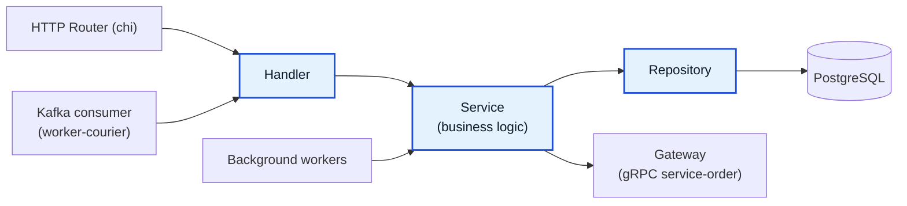

# Courier Service

Production-ready микросервис на Go для управления курьерами и обработкой заказов.
Сервис предоставляет HTTP API, работает с PostgreSQL и обрабатывает события заказов через Kafka/gRPC интеграции с `service-order`.
В проекте реализованы воркеры, метрики и базовые механизмы отказоустойчивости.

[](https://github.com/timurgondin/service-courier/actions/workflows/ci.yml)


## Содержание

- [О проекте](#о-проекте)
- [Архитектура сервиса](#архитектура-сервиса)
- [Что умеет сервис](#что-умеет-сервис)
- [Технологии](#технологии)
- [Требования](#требования)
- [Быстрый старт](#быстрый-старт)
- [HTTP API](#http-api)
- [Мониторинг](#мониторинг)
- [Тестирование](#тестирование)
- [Структура проекта](#структура-проекта)

## О проекте

Система состоит из **3 элементов**:

1. **Courier Service (этот репозиторий):**
   HTTP API для управления курьерами и доставками + фоновые воркеры.
2. **Infrastructure Compose:**
   Docker Compose в каталоге `infrastructure/` для локального запуска Kafka-окружения.
3. **Order Service (внешний сервис):**
   Отдельный микросервис: [Avito-courses/service-order](https://github.com/Avito-courses/service-order).
   Через него идет обмен заказами и интеграция по gRPC/Kafka.

## Архитектура сервиса



Слои внутри `service-courier`:

- `handler` - принимает HTTP/Kafka сообщения, валидирует входные данные, маппит ошибки в HTTP коды.
- `service` - бизнес-правила (назначение/снятие курьера, дедлайны, release просроченных доставок).
- `repository` - работа с PostgreSQL через `pgx` и `squirrel`.
- `gateway` - gRPC-клиент к `service-order` с retry.
- `worker` - фоновые процессы (polling заказов, release просроченных доставок, Kafka consumer).

## Что умеет сервис

- CRUD-операции по курьерам
- Назначение/снятие курьера на заказ
- Выбор доступного курьера с минимальной нагрузкой
- Расчет дедлайна доставки по типу транспорта:
  - `car` -> 5 минут
  - `scooter` -> 15 минут
  - `on_foot` -> 30 минут
- Фоновый release просроченных доставок
- Polling заказов из `service-order` по gRPC
- Обработка Kafka-событий изменения статусов заказа
- Graceful shutdown: корректная остановка HTTP сервера и фоновых воркеров по `SIGINT`/`SIGTERM`
- Rate limiting (token bucket)
- Retry для gRPC gateway
- Транзакционное управление delivery-операциями через [avito-tech/go-transaction-manager](https://github.com/avito-tech/go-transaction-manager)
- Метрики Prometheus + дашборд Grafana + pprof

## Технологии

- Go, chi, gRPC
- PostgreSQL, pgx, Squirrel
- [avito-tech/go-transaction-manager](https://github.com/avito-tech/go-transaction-manager) (trm)
- Kafka (Sarama)
- goose (миграции)
- Prometheus, Grafana, pprof
- testcontainers, testify, gomock
- Docker, Docker Compose
- GitHub Actions, golangci-lint

## Требования

- Go `1.25.3+`
- Docker + Docker Compose
- Make
- Goose CLI (для `make migrate-up` / `make migrate-down`)

## Быстрый старт

### 1. Поднять Kafka-инфраструктуру

```bash
docker compose -f infrastructure/docker-compose.yml up -d
```

### 2. Поднять внешний Order Service

Запустите `service-order` по инструкции из репозитория: [Avito-courses/service-order](https://github.com/Avito-courses/service-order).

### 3. Подготовить переменные окружения

```bash
cp .env.example .env
```

### 4. Запустить PostgreSQL

```bash
docker compose up -d postgres
```

### 5. Применить миграции

```bash
make migrate-up
```

### 6. Запустить Courier Service + Worker + Monitoring

```bash
docker compose up -d --build
```

## HTTP API

| Метод | Путь | Назначение |
|---|---|---|
| GET | `/ping` | Проверка доступности |
| HEAD | `/healthcheck` | Healthcheck |
| GET | `/couriers` | Список курьеров |
| GET | `/courier/{id}` | Получить курьера |
| POST | `/courier` | Создать курьера |
| PUT | `/courier` | Обновить курьера |
| POST | `/delivery/assign` | Назначить курьера на заказ |
| POST | `/delivery/unassign` | Снять курьера с заказа |
| GET | `/metrics` | Метрики Prometheus |

### Пример создания курьера

```bash
curl -X POST http://localhost:8082/courier \
  -H "Content-Type: application/json" \
  -d '{"name":"Ivan","phone":"+79990001122","status":"available","transport_type":"car"}'
```

### Пример назначения доставки

```bash
curl -X POST http://localhost:8082/delivery/assign \
  -H "Content-Type: application/json" \
  -d '{"order_id":"f819526d-6a7c-48eb-b535-43989469d1ca"}'
```

## Мониторинг

- Prometheus метрики: `GET /metrics`
- pprof: `http://127.0.0.1:6060/debug/pprof`
- Prometheus UI: `http://localhost:9090`
- Grafana UI: `http://localhost:3000`

## Тестирование

Локальный запуск всех тестов:

```bash
go test ./... -v
```

Запуск с покрытием:

```bash
go test -coverprofile=coverage.out ./...
go tool cover -html=coverage.out
```

Для интеграционных тестов нужен запущенный Docker, так как они поднимают контейнеры через `testcontainers-go`.

Проверки в CI (`.github/workflows/ci.yml`):

- `golangci-lint`
- `go test` + coverage

## Структура проекта

```text
.
├── cmd/
│   ├── service/                     # main: HTTP API + internal workers
│   └── worker/                      # main: Kafka consumer process
├── internal/
│   ├── handler/
│   │   ├── common/                  # /ping, /healthcheck
│   │   ├── courier/                 # HTTP handlers for couriers
│   │   ├── delivery/                # HTTP handlers for deliveries
│   │   └── queues/                  # Kafka handlers
│   ├── service/
│   │   ├── courier/                 # courier use cases
│   │   ├── delivery/                # assign/unassign/complete/release + workers
│   │   └── order/                   # order event use cases
│   ├── repository/
│   │   ├── courier/                 # PostgreSQL queries for couriers
│   │   └── delivery/                # PostgreSQL queries for deliveries
│   ├── gateway/
│   │   └── order/                   # gRPC client to order-service + retry
│   ├── model/
│   │   ├── courier/                 # domain models/errors/constants
│   │   ├── delivery/
│   │   └── order/
│   ├── dto/                         # transport DTO
│   ├── proto/                       # order.proto + generated *.pb.go
│   ├── metrics/                     # Prometheus collectors + metrics middleware
│   ├── middleware/                  # rate-limit middleware
│   ├── pkg/
│   │   ├── db/                      # pgx pool initialization
│   │   ├── limiter/                 # token bucket limiter
│   │   └── retry/                   # retry executor/backoff strategies
│   └── integration/                 # testcontainers helpers for integration tests
├── migrations/                      # goose migrations
├── infrastructure/
│   └── docker-compose.yml           # zookeeper + kafka + kafka-ui + topic-creator
├── grafana/
│   └── Dashboard-*.json             # dashboard export
├── .github/workflows/
│   └── ci.yml                       # lint + tests + coverage
├── Dockerfile
├── docker-compose.yml               # app + postgres + monitoring stack
├── prometheus.yml
├── .env.example
└── Makefile
```
